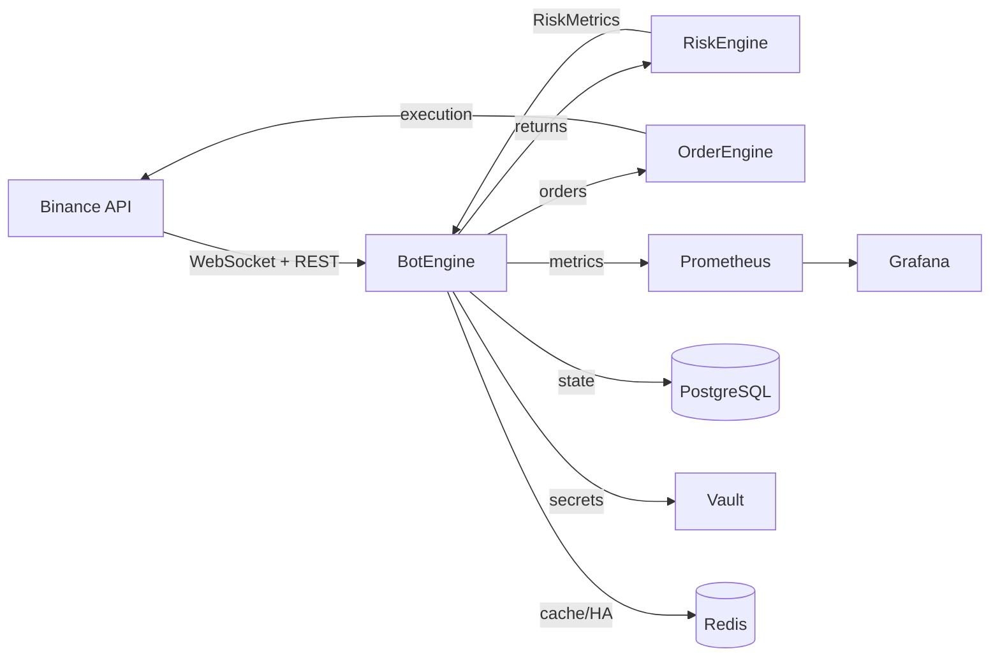
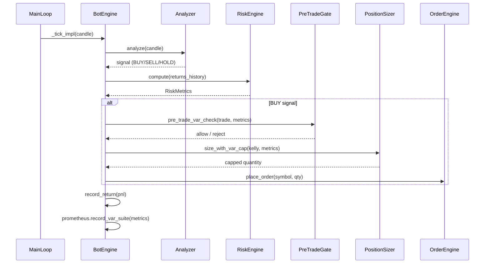
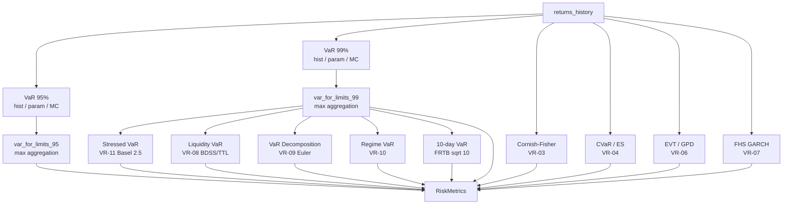
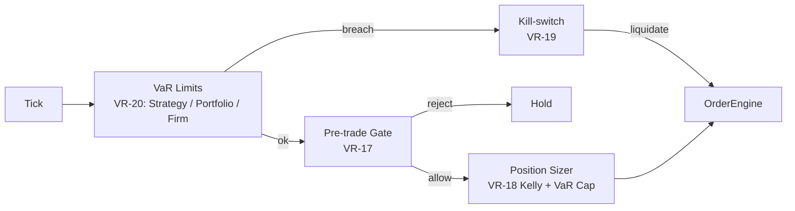
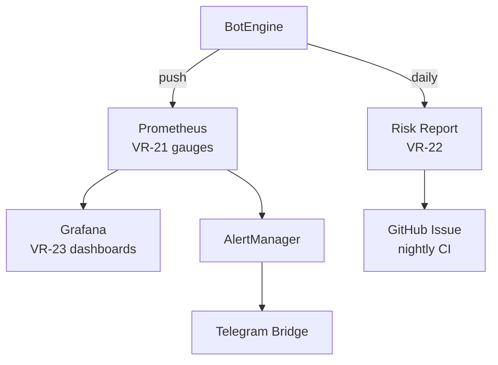
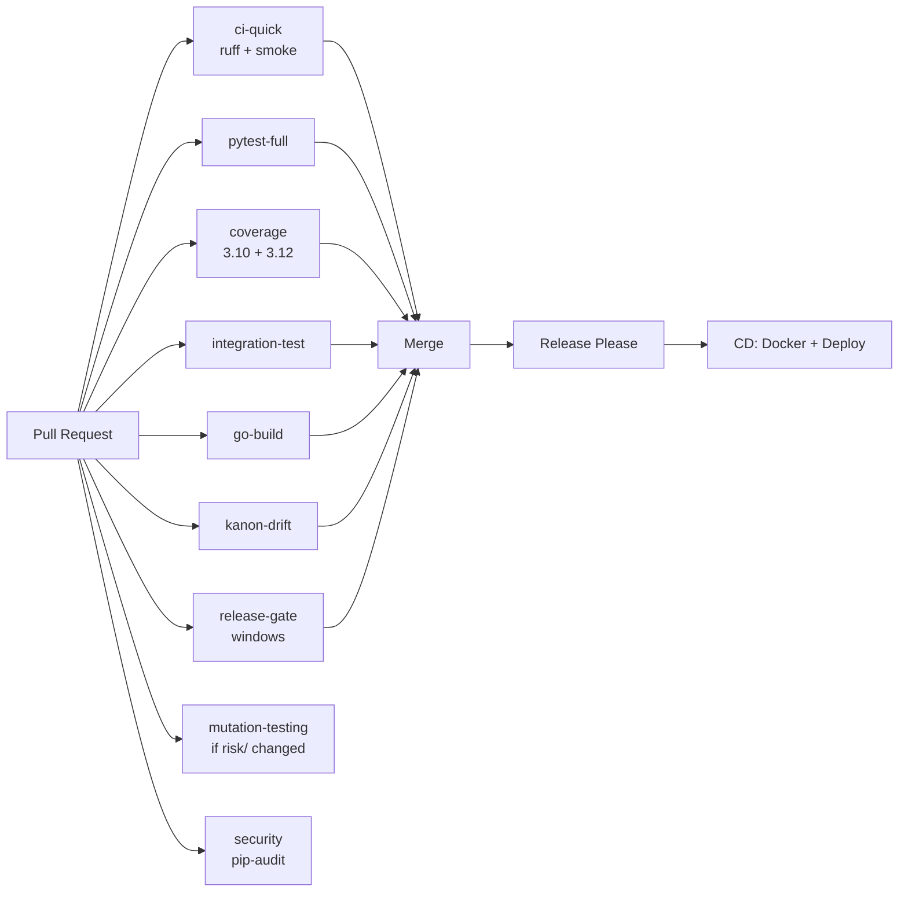

# Architecture Overview

## System Context

super_otonom is a crypto trading bot with an institutional-grade risk engine.
It connects to exchanges via CCXT, runs a tick-based trading loop, and enforces
Basel III/FRTB risk limits on every trade decision.



## Core Loop (Tick Pipeline)

Each tick follows this pipeline:



## Risk Engine Pipeline

`RiskEngine.compute()` executes this chain on every call:



## VaR Model Zoo

| # | Model | Module | Key Function |
|---|---|---|---|
| VR-02 | Historical VaR | `var_models.py` | `historical_var()` |
| VR-02 | Parametric VaR (Student-t) | `var_models.py` | `parametric_var()` |
| VR-02 | Monte Carlo VaR | `var_models.py` | `monte_carlo_var()` |
| VR-03 | Cornish-Fisher VaR | `var_models.py` | `cornish_fisher_var()` |
| VR-04 | CVaR (3 methods) | `cvar_models.py` | `historical_cvar()`, `parametric_cvar()`, `mc_cvar()` |
| VR-06 | EVT / GPD | `evt.py` | `pot_var_cvar()` |
| VR-07 | FHS GARCH(1,1) | `fhs.py` | `fhs_var_cvar()` |
| VR-08 | Liquidity VaR | `lvar.py` | `compute_lvar()` |
| VR-09 | VaR Decomposition | `var_decomposition.py` | `compute_var_decomposition()` |
| VR-10 | Regime VaR | `regime_var.py` | `RegimeConditionalVaR` |
| VR-11 | Stressed VaR | `stressed_var.py` | `compute_stressed_var()` |

## Limit Enforcement Chain



## Backtesting & Validation

| Test | Module | Standard |
|---|---|---|
| Kupiec POF | `var_backtest.py` | Kupiec (1995) |
| Christoffersen CC | `var_backtest.py` | Christoffersen (1998) |
| Basel Traffic Light | `var_backtest.py` | Basel Committee |
| P&L Attribution | `pnl_attribution.py` | Unexplained drift detection |
| Property-based | `test_var_properties_vr26.py` | Hypothesis invariants |
| Mutation testing | CI (mutmut) | 80% kill-rate gate |

## Observability Stack



### Key Prometheus Metrics

- `bot_var_99_pct`, `bot_cvar_975_pct` — core risk
- `bot_var_10d_99_pct`, `bot_cvar_10d_975_pct` — Basel FRTB
- `bot_stressed_var_pct` — Basel 2.5
- `bot_var_liquidity_adjusted` — LVaR per symbol
- `bot_kupiec_pvalue` — backtest health
- `bot_stress_worst_scenario_pnl_pct` — stress grid

## Package Layout

```text
super_otonom_v7/
├── super_otonom/           # Main package (102 modules)
│   ├── core/               # BotEngine, MainLoop, Config, StateMachine
│   ├── trading/            # OrderEngine, PositionSizer, StagedExit
│   ├── risk/               # 18 modules — VaR/CVaR/EVT/FHS/LVaR/...
│   ├── execution/          # TWAP, VWAP
│   ├── signals/            # 12 signal modules
│   ├── ha/                 # Leader election, health, replication
│   ├── infra/              # Redis, Vault, Timescale, logging
│   ├── analysis/           # Analyzer, CorrelationManager
│   ├── monitoring/         # Prometheus, AlertManager, deploy checks
│   ├── audit/              # Topology audits, drift checks
│   └── pipelines/          # Data pipelines
├── tests/                  # 1000+ tests
│   ├── risk/               # 27 VR test files + fixtures
│   └── branch/             # Branch-matrix mutation tests
├── docs/                   # Documentation (this site)
├── data/                   # Fixtures, manifests, stress grids
├── scripts/                # Mutation gates, backup, DR
├── .github/workflows/      # 9 CI/CD workflows
├── docker-compose.yml      # Full stack
└── pyproject.toml          # Build config
```

## CI Pipeline


